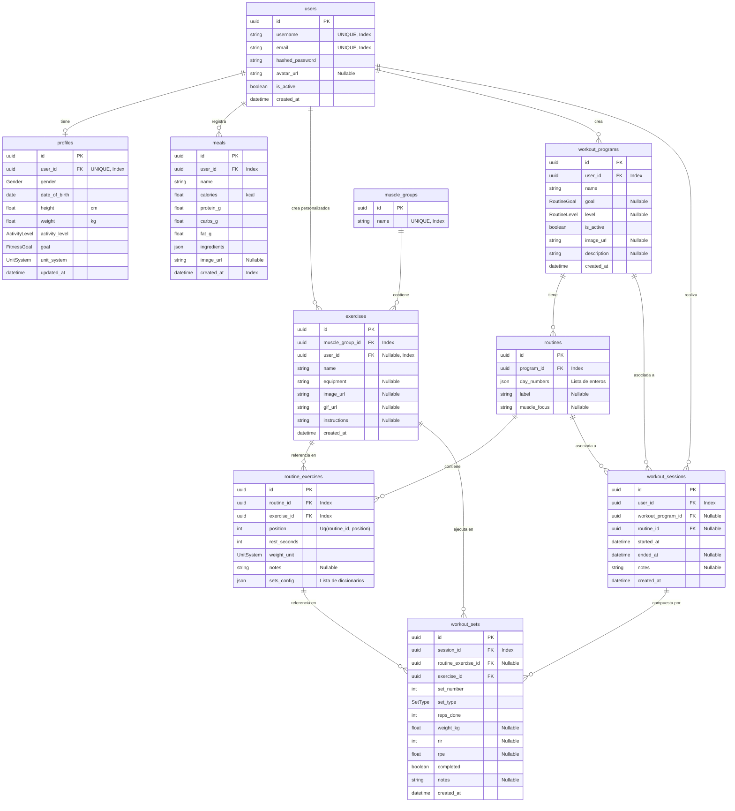

# Esquema de Base de Datos - FitCore

Este documento describe la estructura de la base de datos de **FitCore**, incluyendo relaciones, tablas, campos y los enums utilizados en el sistema.

---

## 1. Diagrama Entidad-Relación (ER)

El siguiente diagrama Mermaid ilustra cómo se relacionan las tablas de la base de datos. Los campos marcados con `PK` representan claves primarias y `FK` representan claves foráneas.

---

## 2. Tipos Enumerados (Enums)

### Gender
Representa el género biológico del usuario para el cálculo de la Tasa Metabólica Basal (BMR).
* `male` — Masculino.
* `female` — Femenino.
* `other` — Otro.

### ActivityLevel
Nivel de actividad física diaria utilizado para calcular el TDEE (Gasto Energético Total Diario).
* `sedentary` — Poco o nada de ejercicio (BMR × 1.2).
* `light` — Ejercicio ligero de 1 a 3 días por semana (BMR × 1.375).
* `moderate` — Ejercicio moderado de 3 a 5 días por semana (BMR × 1.55).
* `very` — Ejercicio intenso de 6 a 7 días por semana (BMR × 1.725).
* `extra` — Ejercicio muy intenso o trabajo físico demandante (BMR × 1.9).

### FitnessGoal
Meta del usuario para realizar el ajuste calórico diario.
* `lose` — Pérdida de peso (Déficit de 500 kcal).
* `maintain` — Mantenimiento de peso (Sin ajuste).
* `gain` — Ganancia de masa muscular (Superávit de 300 kcal).

### UnitSystem
Sistema de unidades preferido por el usuario.
* `metric` — Kilogramos y centímetros.
* `imperial` — Libras y pulgadas.

### RoutineGoal
Objetivo principal de un programa de entrenamiento.
* `hypertrophy` — Hipertrofia (Ganancia de músculo).
* `strength` — Fuerza.
* `definition` — Definición muscular.
* `endurance` — Resistencia.

### RoutineLevel
Nivel recomendado para un programa de entrenamiento.
* `beginner` — Principiante.
* `intermediate` — Intermedio.
* `advanced` — Avanzado.

### SetType
Tipo de serie registrada durante un entrenamiento.
* `normal` — Serie de trabajo regular.
* `warmup` — Serie de calentamiento previo.
* `drop_set` — Serie descendente (bajada de peso inmediata sin descanso).
* `failure` — Serie llevada al fallo muscular absoluto.

---

## 3. Diccionario de Datos (Detalle de Tablas)

### 3.1 Tabla `users`
Almacena la información de autenticación e identidad de los usuarios.

| Columna | Tipo | Restricciones | Descripción |
| :--- | :--- | :--- | :--- |
| `id` | `UUID` | `PK`, `Default: UUIDv4` | Identificador único de usuario. |
| `username` | `VARCHAR` | `UNIQUE`, `NOT NULL`, `Index` | Nombre de usuario único. |
| `email` | `VARCHAR` | `UNIQUE`, `NOT NULL`, `Index` | Dirección de correo electrónico única. |
| `hashed_password` | `VARCHAR` | `NOT NULL` | Contraseña cifrada con algoritmo seguro. |
| `avatar_url` | `VARCHAR` | `NULL` | Enlace a la imagen del avatar en Google Cloud Storage. |
| `is_active` | `BOOLEAN` | `DEFAULT: True` | Indica si la cuenta del usuario está activa. |
| `created_at` | `DATETIME` | `NOT NULL` | Fecha de creación del registro en UTC. |

### 3.2 Tabla `profiles`
Contiene la información antropométrica y metas del usuario.

| Columna | Tipo | Restricciones | Descripción |
| :--- | :--- | :--- | :--- |
| `id` | `UUID` | `PK`, `Default: UUIDv4` | Identificador único del perfil. |
| `user_id` | `UUID` | `FK (users.id)`, `UNIQUE`, `Index` | Relación uno a uno con el usuario. |
| `gender` | `VARCHAR (Enum)` | `NOT NULL` | Género biológico del usuario (`Gender`). |
| `date_of_birth` | `DATE` | `NOT NULL` | Fecha de nacimiento para el cálculo de edad. |
| `height` | `FLOAT` | `NOT NULL` | Altura en centímetros. |
| `weight` | `FLOAT` | `NOT NULL` | Peso corporal actual en kilogramos. |
| `activity_level` | `VARCHAR (Enum)` | `NOT NULL` | Nivel de actividad física del usuario (`ActivityLevel`). |
| `goal` | `VARCHAR (Enum)` | `NOT NULL` | Meta del usuario (`FitnessGoal`). |
| `unit_system` | `VARCHAR (Enum)` | `DEFAULT: metric` | Sistema de medición seleccionado (`UnitSystem`). |
| `updated_at` | `DATETIME` | `NOT NULL` | Última actualización del perfil. |

### 3.3 Tabla `meals`
Registra los alimentos consumidos y analizados por los usuarios.

| Columna | Tipo | Restricciones | Descripción |
| :--- | :--- | :--- | :--- |
| `id` | `UUID` | `PK`, `Default: UUIDv4` | Identificador único de la comida. |
| `user_id` | `UUID` | `FK (users.id)`, `Index` | Usuario que registró la comida. |
| `name` | `VARCHAR` | `NOT NULL` | Nombre descriptivo del platillo. |
| `calories` | `FLOAT` | `NOT NULL` | Total de calorías estimadas en kcal. |
| `protein_g` | `FLOAT` | `NOT NULL` | Gramos de proteína totales. |
| `carbs_g` | `FLOAT` | `NOT NULL` | Gramos de carbohidratos totales. |
| `fat_g` | `FLOAT` | `NOT NULL` | Gramos de grasa totales. |
| `ingredients` | `JSON` | `DEFAULT: []` | Lista de ingredientes con su peso y desglose de macros individual. |
| `image_url` | `VARCHAR` | `NULL` | URL de la imagen del platillo guardada en Google Cloud Storage. |
| `created_at` | `DATETIME` | `Index` | Fecha y hora en la que se consumió la comida en UTC. |

### 3.4 Tabla `muscle_groups`
Catálogo global de los grupos musculares.

| Columna | Tipo | Restricciones | Descripción |
| :--- | :--- | :--- | :--- |
| `id` | `UUID` | `PK`, `Default: UUIDv4` | Identificador del grupo muscular. |
| `name` | `VARCHAR` | `UNIQUE`, `NOT NULL`, `Index` | Nombre del grupo muscular (ej. Pectorales). |

### 3.5 Tabla `exercises`
Catálogo de ejercicios disponibles globales del sistema (`user_id` es NULL) y creados por usuarios.

| Columna | Tipo | Restricciones | Descripción |
| :--- | :--- | :--- | :--- |
| `id` | `UUID` | `PK`, `Default: UUIDv4` | Identificador del ejercicio. |
| `muscle_group_id` | `UUID` | `FK (muscle_groups.id)`, `Index` | Grupo muscular principal que trabaja. |
| `user_id` | `UUID` | `FK (users.id)`, `NULL`, `Index` | Propietario si es personalizado. NULL si es global. |
| `name` | `VARCHAR` | `NOT NULL` | Nombre del ejercicio (ej. Press de Banca). |
| `equipment` | `VARCHAR` | `NULL` | Equipamiento necesario (ej. Mancuernas, Barra). |
| `image_url` | `VARCHAR` | `NULL` | Enlace a una imagen ilustrativa del ejercicio. |
| `gif_url` | `VARCHAR` | `NULL` | Enlace a un GIF demostrativo de la ejecución. |
| `instructions` | `TEXT` | `NULL` | Explicación detallada del paso a paso del ejercicio. |
| `created_at` | `DATETIME` | `NOT NULL` | Fecha de alta del ejercicio. |

### 3.6 Tabla `workout_programs`
Planes o programas estructurados de entrenamiento.

| Columna | Tipo | Restricciones | Descripción |
| :--- | :--- | :--- | :--- |
| `id` | `UUID` | `PK`, `Default: UUIDv4` | Identificador del programa. |
| `user_id` | `UUID` | `FK (users.id)`, `Index` | Creador del programa de entrenamiento. |
| `name` | `VARCHAR` | `NOT NULL` | Nombre del programa (ej. Empuje/Tirón/Pierna). |
| `goal` | `VARCHAR (Enum)` | `NULL` | Objetivo general (`RoutineGoal`). |
| `level` | `VARCHAR (Enum)` | `NULL` | Nivel del programa (`RoutineLevel`). |
| `is_active` | `BOOLEAN` | `DEFAULT: False` | Define si es el plan actualmente activo para el usuario. |
| `image_url` | `VARCHAR` | `NULL` | Portada del programa. |
| `description` | `TEXT` | `NULL` | Descripción del enfoque del programa. |
| `created_at` | `DATETIME` | `NOT NULL` | Fecha de creación. |

### 3.7 Tabla `routines`
Días o rutinas específicas que integran un programa de entrenamiento.

| Columna | Tipo | Restricciones | Descripción |
| :--- | :--- | :--- | :--- |
| `id` | `UUID` | `PK`, `Default: UUIDv4` | Identificador de la rutina. |
| `program_id` | `UUID` | `FK (workout_programs.id)` | Programa al que pertenece la rutina. |
| `day_numbers` | `JSON` | `DEFAULT: []` | Días de la semana asignados (ej. `[1, 3, 5]` para lunes, miércoles y viernes). |
| `label` | `VARCHAR` | `NULL` | Nombre del día (ej. Día de Pecho y Tríceps, Push Day). |
| `muscle_focus` | `VARCHAR` | `NULL` | Enfoque muscular de la sesión. |

### 3.8 Tabla `routine_exercises`
Relación de ejercicios dentro de una rutina con sus especificaciones.

| Columna | Tipo | Restricciones | Descripción |
| :--- | :--- | :--- | :--- |
| `id` | `UUID` | `PK`, `Default: UUIDv4` | Identificador de la relación. |
| `routine_id` | `UUID` | `FK (routines.id)`, `Index` | Rutina en la que se inscribe el ejercicio. |
| `exercise_id` | `UUID` | `FK (exercises.id)`, `Index` | Ejercicio seleccionado. |
| `position` | `INT` | `NOT NULL` | Orden en el que se realiza el ejercicio (`UniqueConstraint` con `routine_id`). |
| `rest_seconds` | `INT` | `DEFAULT: 90` | Segundos recomendados de descanso entre series. |
| `weight_unit` | `VARCHAR (Enum)` | `DEFAULT: metric` | Unidad de peso recomendada (`UnitSystem`). |
| `notes` | `TEXT` | `NULL` | Observaciones especiales de ejecución. |
| `sets_config` | `JSON` | `DEFAULT: []` | Lista de diccionarios indicando series objetivo (ej. `[{"reps": 12, "rir": 2}]`). |

### 3.9 Tabla `workout_sessions`
Historial de entrenamientos reales iniciados por el usuario.

| Columna | Tipo | Restricciones | Descripción |
| :--- | :--- | :--- | :--- |
| `id` | `UUID` | `PK`, `Default: UUIDv4` | Identificador del entrenamiento real. |
| `user_id` | `UUID` | `FK (users.id)`, `Index` | Usuario que entrena. |
| `workout_program_id`| `UUID` | `FK (workout_programs.id)`, `NULL` | Programa que se está ejecutando en ese momento. |
| `routine_id` | `UUID` | `FK (routines.id)`, `NULL` | Rutina diaria ejecutada. |
| `started_at` | `DATETIME` | `NOT NULL` | Fecha y hora de inicio de la sesión en UTC. |
| `ended_at` | `DATETIME` | `NULL` | Fecha y hora de finalización. Si es NULL, la sesión está activa. |
| `notes` | `TEXT` | `NULL` | Comentarios generales sobre cómo se sintió el entrenamiento. |
| `created_at` | `DATETIME` | `NOT NULL` | Fecha de creación del registro. |

### 3.10 Tabla `workout_sets`
Registro de cada serie realizada durante una sesión de entrenamiento.

| Columna | Tipo | Restricciones | Descripción |
| :--- | :--- | :--- | :--- |
| `id` | `UUID` | `PK`, `Default: UUIDv4` | Identificador de la serie. |
| `session_id` | `UUID` | `FK (workout_sessions.id)`, `Index` | Sesión activa en la que se inscribe. |
| `routine_exercise_id`| `UUID` | `FK (routine_exercises.id)`, `NULL` | Referencia opcional al ejercicio planificado de la rutina. |
| `exercise_id` | `UUID` | `FK (exercises.id)` | Ejercicio que se ejecutó. |
| `set_number` | `INT` | `NOT NULL` | Número de serie correlativo (1, 2, 3...). |
| `set_type` | `VARCHAR (Enum)` | `DEFAULT: normal` | Tipo de esfuerzo realizado (`SetType`). |
| `reps_done` | `INT` | `NOT NULL` | Número de repeticiones completadas con éxito. |
| `weight_kg` | `FLOAT` | `NULL` | Peso levantado en kilogramos. |
| `rir` | `INT` | `NULL` | Repeticiones en reserva autopercibidas (RIR). |
| `rpe` | `FLOAT` | `NULL` | Índice de esfuerzo percibido (RPE de 1 a 10). |
| `completed` | `BOOLEAN` | `DEFAULT: True` | Indica si la serie se completó satisfactoriamente. |
| `notes` | `TEXT` | `NULL` | Comentarios individuales de la serie. |
| `created_at` | `DATETIME` | `NOT NULL` | Timestamp exacto en que se registró la serie. |
