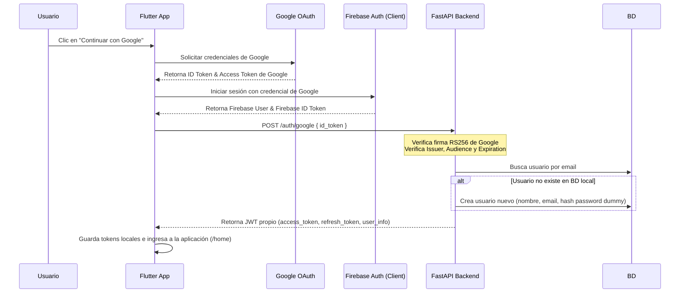

# Autenticación con Google (Firebase)

Este documento detalla el flujo de autenticación implementado en **FitCore** utilizando **Google Sign-In** a través de **Firebase Auth** en la aplicación móvil y la verificación offline de tokens en el backend de FastAPI.

## Diagrama de Secuencia

El siguiente diagrama ilustra cómo interactúan la aplicación móvil, los proveedores de identidad y el backend:



---

## Flujo Paso a Paso

1. **Autenticación en el Cliente:**
   - El usuario inicia el flujo desde la aplicación Flutter presionando el botón "Continuar con Google".
   - La aplicación móvil utiliza el paquete `google_sign_in` para abrir el Selector de Cuentas.
   - Con las credenciales obtenidas de Google, el cliente inicia sesión en Firebase Client (`firebase_auth`).
   - Una vez autenticado en Firebase, el cliente solicita un ID Token renovado mediante `getIdToken(true)`.

2. **Envío de Token al Backend:**
   - La aplicación móvil realiza una petición `POST` al endpoint `/api/v1/auth/google` del backend enviando el `id_token` en el cuerpo de la solicitud:
     ```json
     {
       "id_token": "<firebase_id_token>"
     }
     ```

3. **Verificación en el Backend (FastAPI):**
   - El backend realiza una verificación local (offline) del token para asegurar su validez y procedencia sin necesidad de contactar constantemente a las APIs de Firebase en cada llamada:
     - **Claves Públicas:** Obtiene y cachea (según la cabecera `Cache-Control`) las claves públicas oficiales de Google desde: `https://www.googleapis.com/robot/v1/metadata/x509/securetoken@system.gserviceaccount.com`.
     - **Algoritmo:** Verifica que el token esté firmado utilizando el algoritmo `RS256` buscando el parámetro `kid` en la cabecera del token.
     - **Audience (aud):** Comprueba que la audiencia del token coincida exactamente con el ID del proyecto Firebase (`fitcoreapp-7d1ff`).
     - **Issuer (iss):** Valida que el emisor sea `https://securetoken.google.com/fitcoreapp-7d1ff`.
     - **Expiración (exp):** Verifica que el token no haya expirado.

4. **Registro o Inicio de Sesión local:**
   - El backend lee el correo electrónico (`email`) contenido en los reclamos verificados del token.
   - **Caso 1: Usuario Existente:** Si el correo electrónico ya existe en la base de datos (incluso si fue creado inicialmente mediante registro nativo por correo/contraseña), el backend valida al usuario y procede a generar la sesión.
   - **Caso 2: Usuario Nuevo:** Si el correo no existe localmente, se registra de forma automática:
     - Se genera un nombre de usuario (`username`) único basado en su dirección de correo electrónico.
     - Se genera una contraseña aleatoria de alta seguridad (dummy password) que se hashea y almacena en el campo de contraseña nativa, garantizando la consistencia del esquema de la base de datos sin comprometer la seguridad.
   - **Respuesta:** El backend retorna el objeto `TokenResponse` que contiene los JWTs de sesión propios de la API de FitCore (`access_token`, `refresh_token`) y los datos del usuario.
